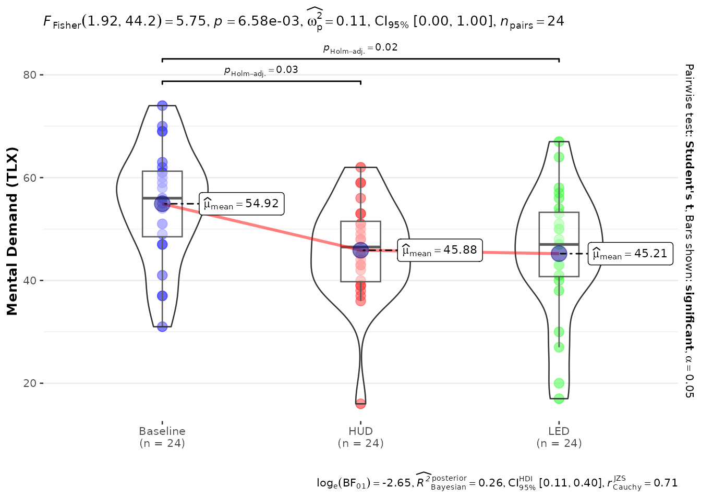
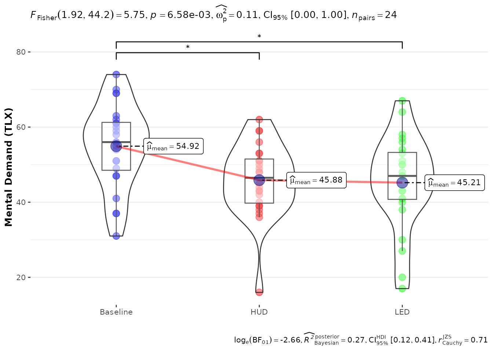

# Analyzing a typical user study

``` r

library(colleyRstats)
#> Loading required package: ggplot2
#> Registered S3 methods overwritten by 'ggpp':
#>   method                  from   
#>   heightDetails.titleGrob ggplot2
#>   widthDetails.titleGrob  ggplot2
```

This vignette walks through the workflow `colleyRstats` was built for: a
within-subjects user study, from raw data to the text and figures that
go into the manuscript. Every number in the paper should come out of
this script – no retyping, no copy-paste drift.

## The study data

Twenty-four participants experienced three interface conditions and
rated their mental demand (0–100, NASA-TLX style) and trust (1–7 Likert)
after each. In your project this data frame comes from your logging or
survey export; here we simulate it.

``` r

set.seed(42)
n <- 24

main_df <- data.frame(
  Participant = factor(rep(seq_len(n), each = 3)),
  ConditionID = factor(rep(c("Baseline", "HUD", "LED"), times = n))
)

cond_effect <- c(Baseline = 55, HUD = 46, LED = 44)[as.character(main_df$ConditionID)]
main_df$tlx_mental <- pmin(100, pmax(0, round(cond_effect + rnorm(nrow(main_df), sd = 10))))
main_df$trust <- pmin(7, pmax(1, round(3.5 +
  (main_df$ConditionID != "Baseline") * 0.9 + rnorm(nrow(main_df), sd = 1))))
```

Two things matter before any analysis:

- the participant and condition columns must be **factors** (they are
  above);
- decide up front whether the design is within- or between-subjects – it
  changes the tests, the plots, and the effect sizes.

## The quick route: one call per dependent variable

[`analyze_and_report()`](https://m-colley.github.io/colleyRstats/reference/analyze_and_report.md)
runs the whole per-DV pipeline: it checks the assumptions (and phrases
the justification for the methods section), builds the matching
`ggstatsplot` figure with automatic parametric/non-parametric selection,
reports the omnibus test, and – for three or more groups – the
significant post-hoc comparisons.

``` r

res <- analyze_and_report(
  main_df,
  dv = "tlx_mental", iv = "ConditionID",
  design = "within",
  ylab = "Mental Demand (TLX)"
)
#> Shapiro--Wilk tests indicated no significant deviation from normality in any group (all $p \geq 0.05$); therefore, parametric tests were used.
#> An ANOVA estimation for factorial designs using 'afex' found a significant effect of \ConditionID on tlx\_mental (\F{1.92}{44.2}{5.75}, \p{0.007}, $\omega_{p}^{2}$ = 0.11).
#> A Student's t post-hoc test found that Baseline was significantly higher (\m{54.92}, \sd{11.10}) in terms of tlx\_mental compared to HUD (\m{45.88}, \sd{9.76}; \padj{0.033}).
#> A Student's t post-hoc test found that Baseline was significantly higher (\m{54.92}, \sd{11.10}) in terms of tlx\_mental compared to LED (\m{45.21}, \sd{12.51}; \padj{0.015}).
```

The result carries everything separately, so you can place the pieces
where they belong:

``` r

res$plot
```



``` r

res$methods  # for the Methods section
#> [1] "Shapiro--Wilk tests indicated no significant deviation from normality in any group (all $p \\geq 0.05$); therefore, parametric tests were used."
res$text     # the omnibus result
#> [1] "An ANOVA estimation for factorial designs using 'afex' found a significant effect of \\ConditionID on tlx\\_mental (\\F{1.92}{44.2}{5.75}, \\p{0.007}, $\\omega_{p}^{2}$ = 0.11). "
res$posthoc  # significant pairwise comparisons (NULL for 2 groups)
#> [1] "A Student's t post-hoc test found that Baseline was significantly higher (\\m{54.92}, \\sd{11.10}) in terms of tlx\\_mental compared to HUD (\\m{45.88}, \\sd{9.76}; \\padj{0.033}). " 
#> [2] "A Student's t post-hoc test found that Baseline was significantly higher (\\m{54.92}, \\sd{11.10}) in terms of tlx\\_mental compared to LED (\\m{45.21}, \\sd{12.51}; \\padj{0.015}). "
```

For a whole questionnaire battery,
[`report_all()`](https://m-colley.github.io/colleyRstats/reference/report_all.md)
does this for every scale and adds a Holm-corrected summary across the
dependent variables:

``` r

battery <- report_all(
  main_df,
  dvs = c("tlx_mental", "trust"),
  iv = "ConditionID",
  design = "within",
  labels = c(tlx_mental = "Mental Demand", trust = "Trust")
)
#> Shapiro--Wilk tests indicated no significant deviation from normality in any group (all $p \geq 0.05$); therefore, parametric tests were used.
#> An ANOVA estimation for factorial designs using 'afex' found a significant effect of \ConditionID on tlx\_mental (\F{1.92}{44.2}{5.75}, \p{0.007}, $\omega_{p}^{2}$ = 0.11).
#> A Student's t post-hoc test found that Baseline was significantly higher (\m{54.92}, \sd{11.10}) in terms of tlx\_mental compared to HUD (\m{45.88}, \sd{9.76}; \padj{0.033}).
#> A Student's t post-hoc test found that Baseline was significantly higher (\m{54.92}, \sd{11.10}) in terms of tlx\_mental compared to LED (\m{45.21}, \sd{12.51}; \padj{0.015}).
#> Shapiro--Wilk tests indicated a significant deviation from normality for at least one group (minimum $W = 0.79$, $p < 0.001$); therefore, non-parametric tests were used.
#> A Friedman rank sum test found a significant effect of \ConditionID on trust (\chisq(2)=10.93, \p{0.004}, $W_{Kendall}$ = 0.23).
#> A Durbin-Conover post-hoc test found that HUD was significantly higher (\m{4.12}, \sd{1.08}) in terms of \trust compared to Baseline (\m{3.42}, \sd{1.10}; \padj{0.024}).
#> A Durbin-Conover post-hoc test found that LED was significantly higher (\m{4.46}, \sd{0.78}) in terms of \trust compared to Baseline (\m{3.42}, \sd{1.10}; \padj{0.003}).
battery$summary
#>           dv                                              method statistic
#> 1 tlx_mental ANOVA estimation for factorial designs using 'afex'  5.754671
#> 2      trust                              Friedman rank sum test 10.929577
#>       p.value      p.holm
#> 1 0.006577594 0.008466471
#> 2 0.004233235 0.008466471
```

## Step by step, if you prefer control

### 1. Check the assumptions

``` r

check_normality_by_group(main_df, "ConditionID", "tlx_mental")
#> [1] TRUE
#> attr(,"tests")
#>   ConditionID         W   p_value
#> 1    Baseline 0.9709072 0.6894229
#> 2         HUD 0.9310723 0.1030198
#> 3         LED 0.9589363 0.4174263
```

[`assumption_methods_text()`](https://m-colley.github.io/colleyRstats/reference/assumption_methods_text.md)
turns the same checks into the sentence reviewers expect next to the
choice of test:

``` r

assumption_methods_text(main_df, x = "ConditionID", y = "tlx_mental")
#> Shapiro--Wilk tests indicated no significant deviation from normality in any group (all $p \geq 0.05$); therefore, parametric tests were used.
```

### 2. Plot with automatic test selection

The `gg*WithPriorNormalityCheck*` wrappers run the normality check and
pick the parametric or non-parametric variant for you. The `Asterisk`
versions annotate significant pairwise comparisons with APA-style stars
instead of p-values:

``` r

plot_within_stats_asterisk(
  data = main_df,
  x = "ConditionID", y = "tlx_mental",
  ylab = "Mental Demand (TLX)",
  xlabels = c("Baseline", "HUD", "LED")
)
#> Scale for x is already present.
#> Adding another scale for x, which will replace the existing scale.
```



(Every function also has a snake_case alias –
[`plot_within_stats_asterisk()`](https://m-colley.github.io/colleyRstats/reference/ggwithinstatsWithPriorNormalityCheckAsterisk.md)
is
[`ggwithinstatsWithPriorNormalityCheckAsterisk()`](https://m-colley.github.io/colleyRstats/reference/ggwithinstatsWithPriorNormalityCheckAsterisk.md).)

### 3. Factorial designs: the Aligned Rank Transform

When there is more than one factor and normality is violated, the
standard non-parametric route is the Aligned Rank Transform (ARTool).
[`reportART()`](https://m-colley.github.io/colleyRstats/reference/reportART.md)
turns the ANOVA table into LaTeX sentences, and
[`reportArtCon()`](https://m-colley.github.io/colleyRstats/reference/reportArtCon.md)
reports the pairwise contrasts with rank-biserial effect sizes:

``` r

m <- ARTool::art(
  tlx_mental ~ ConditionID + Error(Participant / ConditionID),
  data = main_df
)
reportART(anova(m), dv = "mental demand")
#> The ART found a significant main effect of \ConditionID on mental demand (\F{2}{46}{5.56}, \p{0.007}, $\eta_{p}^{2}$ = 0.19, 95\% CI: [0.04, 1.00]).
```

``` r

ac <- ARTool::art.con(m, ~ ConditionID, adjust = "holm")
reportArtCon(
  ac,
  data = main_df, iv = "ConditionID", dv = "tlx_mental",
  paired = TRUE, id = "Participant"
)
#> A post-hoc test found that tlx\_mental for the \ConditionID Baseline was significantly higher (\m{54.92}, \sd{11.10}) than for HUD (\m{45.88}, \sd{9.76}; \padj{0.016}, \rankbiserial{0.54}) and LED (\m{45.21}, \sd{12.51}; \padj{0.016}, \rankbiserial{0.64}).
```

### 4. Descriptives

``` r

reportMeanAndSD(main_df, iv = "ConditionID", dv = "tlx_mental")
#> %Baseline: \m{54.92}, \sd{11.10}
#> %HUD: \m{45.88}, \sd{9.76}
#> %LED: \m{45.21}, \sd{12.51}
```

## Into the manuscript

Every reporter accepts `sink_to = "results/tlx.tex"` to write its
sentences to a file your manuscript can `\input{}` – re-run the analysis
and the paper updates itself. Figures go through
[`save_paper_figure()`](https://m-colley.github.io/colleyRstats/reference/save_paper_figure.md),
which uses publication presets (ACM-style single-column 3.33 in,
full-width 7 in):

``` r

fig_path <- file.path(tempdir(), "tlx-mental.pdf")
save_paper_figure(res$plot, fig_path, columns = 2)
#> Saved figure to '/tmp/RtmpKmAwD9/tlx-mental.pdf' (7 x 4.66666666666667 in, base font 9 pt).
```

The LaTeX macros used by the reporters (`\F`, `\p`, `\m`, …) are defined
by
[`latex_preamble()`](https://m-colley.github.io/colleyRstats/reference/latex_preamble.md)
or the shipped `colleyRstats.sty`; see
[`vignette("overleaf")`](https://m-colley.github.io/colleyRstats/articles/overleaf.md)
for the full R-to-Overleaf pipeline, including
[`emit_overleaf()`](https://m-colley.github.io/colleyRstats/reference/emit_overleaf.md),
which bundles the entire analysis into a folder that compiles as-is.

## Where to go next

- [`vignette("choosing-a-test")`](https://m-colley.github.io/colleyRstats/articles/choosing-a-test.md)
  – how
  [`recommend_test()`](https://m-colley.github.io/colleyRstats/reference/recommend_test.md)
  picks tests and mixed models (GLMM/CLMM) from the data, and how to
  report them.
- [`vignette("overleaf")`](https://m-colley.github.io/colleyRstats/articles/overleaf.md)
  – macros vs. plain LaTeX, `.sty` handling, and the one-call Overleaf
  bundle.
