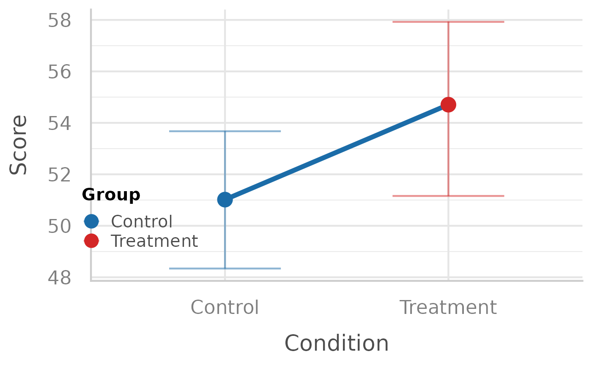

# Getting started with colleyRstats

`colleyRstats` helps streamline a typical analysis workflow: configure a
session, check assumptions, create a plot, and generate manuscript-ready
text.

## Session setup

Attach the packages you need first, then configure the session.
[`colleyRstats_setup()`](https://m-colley.github.io/colleyRstats/reference/colleyRstats_setup.md)
sets the package’s `ggplot2` theme, so every figure below comes out with
consistent typography.

``` r

library(colleyRstats)
#> Loading required package: ggplot2
#> Registered S3 methods overwritten by 'ggpp':
#>   method                  from   
#>   heightDetails.titleGrob ggplot2
#>   widthDetails.titleGrob  ggplot2

colleyRstats_setup(print_citation = FALSE, verbose = FALSE)
```

If you also want the package’s `conflicted` preferences –
[`dplyr::filter()`](https://dplyr.tidyverse.org/reference/filter.html)
over [`stats::filter()`](https://rdrr.io/r/stats/filter.html),
[`psych::describe()`](https://rdrr.io/pkg/psych/man/describe.html) over
[`Hmisc::describe()`](https://rdrr.io/pkg/Hmisc/man/describe.html), and
so on – pass `set_conflicts = TRUE`, and put that call **after** every
[`library()`](https://rdrr.io/r/base/library.html) call in the script:

``` r

library(colleyRstats)
library(easystats)
library(dplyr)

colleyRstats_setup(set_conflicts = TRUE)   # last
```

The ordering matters in both directions. Activating `conflicted`
replaces [`library()`](https://rdrr.io/r/base/library.html) for the rest
of the session, and meta-packages such as `easystats` cannot be attached
once it has; and `conflicted` resolves only those names that are
ambiguous among the packages attached at the time, so a call made before
the rest of your [`library()`](https://rdrr.io/r/base/library.html)
calls has less to work with.

## Example data

``` r

set.seed(123)

main_df <- data.frame(
  Participant = factor(rep(1:20, each = 2)),
  ConditionID = factor(rep(c("Control", "Treatment"), times = 20)),
  score = rnorm(40, mean = rep(c(50, 55), times = 20), sd = 8)
)
```

## Check assumptions

``` r

check_normality_by_group(main_df, "ConditionID", "score")
#> [1] TRUE
#> attr(,"tests")
#>   ConditionID         W   p_value
#> 1     Control 0.9378270 0.2180765
#> 2   Treatment 0.9667112 0.6844808
check_homogeneity_by_group(main_df, "ConditionID", "score")
#> [1] TRUE
#> attr(,"test")
#>   df1 df2 statistic         p
#> 1   1  38 0.1081505 0.7440653
```

## Create a plot

``` r

plot_effect(
  data = transform(main_df, Group = ConditionID),
  x = "ConditionID",
  y = "score",
  fillColourGroup = "Group",
  ytext = "Score",
  xtext = "Condition"
)
#> `geom_line()`: Each group consists of only one observation.
#> ℹ Do you need to adjust the group aesthetic?
```



## Produce a reporting sentence

``` r

art_summary <- data.frame(
  Effect = "ConditionID",
  Df = 1,
  `F value` = 5.42,
  `Pr(>F)` = 0.027,
  Df.res = 19,
  check.names = FALSE
)

report_art(art_summary, dv = "score")
#> The ART found a significant main effect of \ConditionID on score (\F{1}{19}{5.42}, \p{0.027}, $\eta_{p}^{2}$ = 0.22, 95\% CI: [0.01, 1.00]).
```

## Next steps

- [`vignette("analyzing-a-user-study")`](https://m-colley.github.io/colleyRstats/articles/analyzing-a-user-study.md)
  walks a complete within-subjects study from raw data to
  manuscript-ready text and figures, including the one-call
  [`analyze_and_report()`](https://m-colley.github.io/colleyRstats/reference/analyze_and_report.md)
  /
  [`report_all()`](https://m-colley.github.io/colleyRstats/reference/report_all.md)
  pipeline.
- [`vignette("choosing-a-test")`](https://m-colley.github.io/colleyRstats/articles/choosing-a-test.md)
  shows how
  [`recommend_test()`](https://m-colley.github.io/colleyRstats/reference/recommend_test.md)
  selects the right test or mixed model from the data, and how to report
  GLMMs/CLMMs.
- [`vignette("overleaf")`](https://m-colley.github.io/colleyRstats/articles/overleaf.md)
  covers getting the LaTeX output into an Overleaf project that compiles
  immediately
  ([`latex_preamble()`](https://m-colley.github.io/colleyRstats/reference/latex_preamble.md),
  [`use_colleyrstats_sty()`](https://m-colley.github.io/colleyRstats/reference/use_colleyrstats_sty.md),
  [`emit_overleaf()`](https://m-colley.github.io/colleyRstats/reference/emit_overleaf.md)).
- Browse the reference for reporting helpers such as
  [`reportMeanAndSD()`](https://m-colley.github.io/colleyRstats/reference/reportMeanAndSD.md)
  and
  [`reportDunnTest()`](https://m-colley.github.io/colleyRstats/reference/reportDunnTest.md),
  and use
  [`generateMoboPlot()`](https://m-colley.github.io/colleyRstats/reference/generateMoboPlot.md)
  /
  [`generateMoboPlot2()`](https://m-colley.github.io/colleyRstats/reference/generateMoboPlot2.md)
  for optimization studies.
