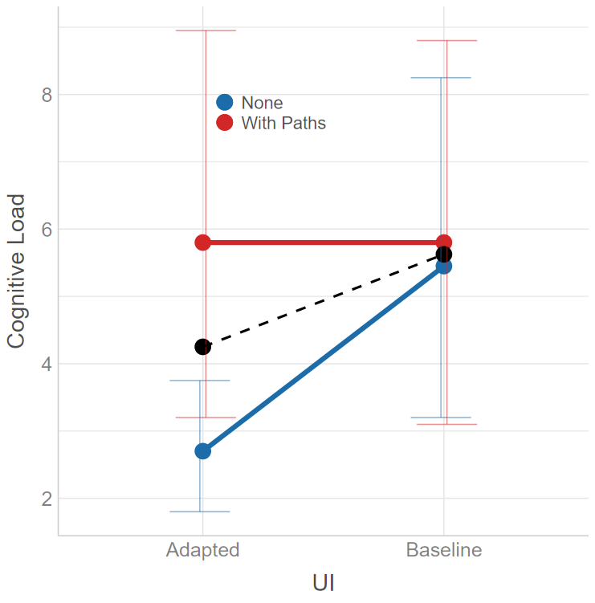
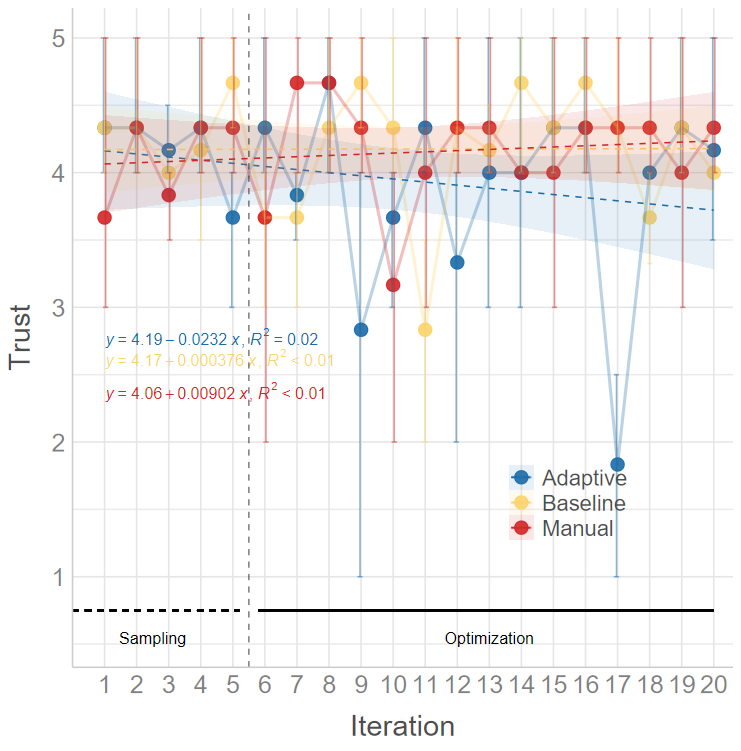

# `{colleyRstats}`: Functions to Streamline Statistical Analysis and Reporting

> Created by [Mark Colley](https://m-colley.github.io/)

| Status | Usage | Miscellaneous |
|----|----|----|
| [](https://github.com/M-Colley/colleyRstats) | [](https://CRAN.R-project.org/package=colleyRstats) | [](https://app.codecov.io/gh/M-Colley/colleyRstats) |
| [](https://lifecycle.r-lib.org/articles/stages.html) | [](https://CRAN.R-project.org/package=colleyRstats) | [](https://doi.org/10.5281/zenodo.18046754) |

`colleyRstats` is a collection of custom R functions that streamline
statistical analysis and result reporting. Built upon popular R packages
such as [ggstatsplot](https://github.com/IndrajeetPatil/ggstatsplot) and
[ARTool](https://github.com/mjskay/ARTool), this collection offers a
wide array of tools for simplifying reproducible analyses, generating
high-quality visualizations, and producing APA-compliant outputs.

The primary goal of this package is to significantly reduce repetitive
coding efforts, allowing you to focus on interpreting results. Whether
you’re dealing with ANOVA assumptions, reporting effect sizes, or
creating publication-ready visualizations, `colleyRstats` makes these
tasks easier.

## Key Features

- **Questionnaire Scoring**:
  [`score_questionnaire()`](https://m-colley.github.io/colleyRstats/reference/score_questionnaire.md)
  applies a published instrument’s own scoring key – NASA-TLX, SUS, UEQ
  / UEQ-S, TiA, AttrakDiff, IPQ, SSQ, FMS, MISC – and
  [`check_questionnaire()`](https://m-colley.github.io/colleyRstats/reference/check_questionnaire.md)
  shows the item mapping before you trust the numbers.
- **Fit What Is Recommended**:
  [`fit_recommended()`](https://m-colley.github.io/colleyRstats/reference/fit_recommended.md)
  carries
  [`recommend_test()`](https://m-colley.github.io/colleyRstats/reference/recommend_test.md)
  through to a fitted model, its post-hoc contrasts, and the manuscript
  sentence, so the test you justify and the model you ran cannot drift
  apart.
- **Reproducible Study Projects**:
  [`use_study_project()`](https://m-colley.github.io/colleyRstats/reference/use_study_project.md)
  scaffolds the whole analysis as a `targets` pipeline with `renv`
  pinning, a Quarto report, and generated LaTeX the manuscript
  `\input{}`s.
- **Automated Assumption Checking**: For ANOVA models, automatically
  verify normality and homogeneity of variance.
- **Enhanced `ggstatsplot` Wrappers**: Automatically switch between
  parametric and non-parametric versions of tests based on the data’s
  characteristics.
- **Principled Test Selection**:
  [`recommend_test()`](https://m-colley.github.io/colleyRstats/reference/recommend_test.md)
  inspects your data (scale, clustering, assumptions) and recommends the
  matching model – including mixed models – with a ready-to-edit fit
  call and methods sentence.
- **APA-Compliant Reporting**: Copy-paste-ready results in LaTeX format,
  suitable for academic publications; reporters cover ART, Dunn, nparLD,
  GLMM/CLMM, and ggstatsplot results.
- **One-Call Pipelines**:
  [`analyze_and_report()`](https://m-colley.github.io/colleyRstats/reference/analyze_and_report.md)
  /
  [`report_all()`](https://m-colley.github.io/colleyRstats/reference/report_all.md)
  produce the figure, methods sentence, omnibus result, and post-hoc
  comparisons for one or many dependent variables in a single call;
  [`emit_overleaf()`](https://m-colley.github.io/colleyRstats/reference/emit_overleaf.md)
  bundles everything into an Overleaf-ready folder.
- **Custom Visualizations**: Generate effect plots and multi-objective
  optimization plots with minimal effort;
  [`save_paper_figure()`](https://m-colley.github.io/colleyRstats/reference/save_paper_figure.md)
  saves them with publication presets.
- **Pareto Analysis and Post-Hoc Tests**: Automate these analyses and
  produce formatted outputs.

## Installation

| Type        | Command                                            |
|:------------|:---------------------------------------------------|
| Release     | `install.packages("colleyRstats")`                 |
| Development | `remotes::install_github("M-Colley/colleyRstats")` |

## Getting Started

The vignettes walk through the main workflows end-to-end:

- [`vignette("getting-started", package = "colleyRstats")`](https://m-colley.github.io/colleyRstats/articles/getting-started.md)
  – setup, assumption checks, plotting, and reporting in a nutshell.
- [`vignette("analyzing-a-user-study", package = "colleyRstats")`](https://m-colley.github.io/colleyRstats/articles/analyzing-a-user-study.md)
  – a typical (HCI) user study from raw data to manuscript-ready text
  and figures.
- [`vignette("choosing-a-test", package = "colleyRstats")`](https://m-colley.github.io/colleyRstats/articles/choosing-a-test.md)
  – how
  [`recommend_test()`](https://m-colley.github.io/colleyRstats/reference/recommend_test.md)
  selects tests and mixed models, and how to report them.
- [`vignette("overleaf", package = "colleyRstats")`](https://m-colley.github.io/colleyRstats/articles/overleaf.md)
  – getting the LaTeX output into an Overleaf project that compiles
  immediately.

The quickest way to see what the package does is the one-call pipeline:

``` r

library(colleyRstats)

result <- analyze_and_report(mtcars, dv = "mpg", iv = "cyl")
result$plot       # ggstatsplot figure (parametric/non-parametric auto-selected)
result$sentences  # methods sentence + omnibus result + post-hoc comparisons
```

### Session setup

[`colleyRstats_setup()`](https://m-colley.github.io/colleyRstats/reference/colleyRstats_setup.md)
applies the package’s `ggplot2` theme so your figures come out with
consistent typography:

``` r

library(colleyRstats)

colleyRstats_setup()
```

It can also register the package’s `conflicted` preferences –
[`dplyr::filter()`](https://dplyr.tidyverse.org/reference/filter.html)
over [`stats::filter()`](https://rdrr.io/r/stats/filter.html),
[`psych::describe()`](https://rdrr.io/pkg/psych/man/describe.html) over
[`Hmisc::describe()`](https://rdrr.io/pkg/Hmisc/man/describe.html), and
so on. That part is opt-in, and **the call belongs after every
[`library()`](https://rdrr.io/r/base/library.html) call in your
script**:

``` r

library(colleyRstats)
library(easystats)
library(dplyr)

colleyRstats_setup(set_conflicts = TRUE)   # last
```

The ordering matters in both directions. Activating `conflicted`
replaces [`library()`](https://rdrr.io/r/base/library.html) for the rest
of the session, and meta-packages such as `easystats` cannot be attached
once it has. And `conflicted` resolves only those names that are
ambiguous among the packages attached at the time, so a call made before
the rest of your [`library()`](https://rdrr.io/r/base/library.html)
calls has less to work with. See
[`?colleyRstats_setup`](https://m-colley.github.io/colleyRstats/reference/colleyRstats_setup.md).

## Summary of Benefits

- **Code Reduction**: Automates common tasks in data analysis, such as
  assumption checks and reporting.
- **Copy-Paste Ready Outputs**: Streamlines report generation with
  LaTeX-ready text outputs.
- **Flexible Visualizations**: Customize plots and output
  professional-quality graphics with ease.
- **Easy-to-Update**: Modifying analyses or text outputs is simple and
  consistent.

------------------------------------------------------------------------

## Primary Functions

> **Naming.** Every function below has a `snake_case` name with a
> `report_*` / `plot_*` / `check_*` prefix, which is the spelling this
> documentation uses and the one to reach for in new code – the prefixes
> make the API discoverable through autocomplete. The original
> `camelCase` spellings –
> [`reportART()`](https://m-colley.github.io/colleyRstats/reference/reportART.md),
> [`generateEffectPlot()`](https://m-colley.github.io/colleyRstats/reference/generateEffectPlot.md),
> [`checkAssumptionsForAnova()`](https://m-colley.github.io/colleyRstats/reference/checkAssumptionsForAnova.md)
> and the rest – are superseded but remain fully supported and are not
> going away, so existing scripts keep working unchanged. Both names
> refer to the same function object and share one help page.

### `score_questionnaire`

Applies a published questionnaire’s own scoring key to raw item columns:
reverse-coding, the recoding it prescribes (centring a semantic
differential to -3..+3, zero-basing the SUS), its subscale structure,
and its published weights.

``` r

score_questionnaire(study, "sus", prefix = "sus_")
#>    SUS Usability Learnability
#> 1 42.5    34.375         75.0
#> 2 40.0    40.625         37.5
#> 3 55.0    59.375         37.5

# Any sheet, scored onto the range the instrument is reported on
score_questionnaire(tlx, "nasa_tlx", scale = c(1, 21))
#>   Mental_Demand Physical_Demand Temporal_Demand Performance Effort Frustration     RTLX
#> 1            65               5              50          25     60          40 40.83333
```

Ten instruments ship: NASA-TLX (raw), SUS, UEQ and UEQ-S, TiA,
AttrakDiff 2, IPQ, SSQ, FMS, MISC.
[`list_questionnaires()`](https://m-colley.github.io/colleyRstats/reference/list_questionnaires.md)
lists them,
[`questionnaire_items()`](https://m-colley.github.io/colleyRstats/reference/questionnaire_items.md)
shows one instrument’s items and scoring notes, and
[`define_questionnaire()`](https://m-colley.github.io/colleyRstats/reference/define_questionnaire.md)
registers your own.

**Verify the mapping before you trust the scores.** Item numbers, order
and polarity belong to the sheet your participants actually saw — survey
tools renumber items, translations reorder them, short forms drop them.
This package applies the *published* key, so a shifted or re-ordered
export scores silently, plausibly, and wrongly. R says so too: a caution
prints alongside the mapping the first time each instrument is scored in
a session. Read it, and check:

``` r

check_questionnaire(study, "sus", prefix = "sus_")
#> System Usability Scale (SUS) -- Brooke (1996); Lewis & Sauro (2009), HCII
#> Assumed response range: 1-5 (the instrument's own; pass `scale` if your survey differed)
#>
#> Item mapping (verify against the survey your participants saw):
#>  item  code column     subscale reverse observed_min observed_max n_missing
#>     1  sus1  sus_1    Usability   FALSE            1            4         0
#>     2  sus2  sus_2    Usability    TRUE            2            5         0
#>     3  sus3  sus_3    Usability   FALSE            2            3         0
#>     4  sus4  sus_4 Learnability    TRUE            1            5         0
#>   ...
```

Related:
[`score_reliability()`](https://m-colley.github.io/colleyRstats/reference/score_reliability.md)
for Cronbach’s alpha and McDonald’s omega per subscale, computed on the
reverse-coded items so a negative alpha means a real problem;
[`reverse_code()`](https://m-colley.github.io/colleyRstats/reference/reverse_code.md);
and
[`summarize_sickness()`](https://m-colley.github.io/colleyRstats/reference/summarize_sickness.md),
which reduces a repeated FMS or MISC rating to peak, mean, final value,
area under the curve and time to threshold. See
[`vignette("scoring-questionnaires")`](https://m-colley.github.io/colleyRstats/articles/scoring-questionnaires.md).

### `fit_recommended`

[`recommend_test()`](https://m-colley.github.io/colleyRstats/reference/recommend_test.md)
stops at advice.
[`fit_recommended()`](https://m-colley.github.io/colleyRstats/reference/fit_recommended.md)
carries it through: coerces the outcome into the class the model family
needs, builds the random-effect term, fits, computes the post-hoc
contrasts with the machinery that matches the fit, and produces the
manuscript sentence.

``` r

fit <- fit_recommended(data, outcome = "rating", predictors = "condition", cluster = "participant")
#> Coerced `rating` to an ordered factor with 4 levels (2 < 3 < 4 < ...).
#> Fitting: Cumulative Link Mixed Model (CLMM) via ordinal::clmm().

fit$text
#> A cumulative link mixed model was fitted for rating.
#> The effect of \textit{conditionB} on rating was not significant
#>   ($OR = 2.83$, 95\% CI $[0.92, 8.69]$, $z = 1.81$, \p{0.070}).
#> The effect of \textit{conditionC} on rating was significant
#>   ($OR = 21.38$, 95\% CI $[5.36, 85.29]$, $z = 4.34$, \pminor{0.001}).

as.data.frame(fit$contrasts)   # Holm-adjusted pairwise comparisons
#>  contrast estimate    SE  df z.ratio p.value
#>  A - B       -1.04 0.573 Inf   -1.81  0.0697
#>  A - C       -3.06 0.706 Inf   -4.34 <0.0001
#>  B - C       -2.02 0.640 Inf   -3.16  0.0032
```

It covers cumulative link models with and without random effects, linear
and generalized linear mixed models, GLMs, ART, nparLD, multinomial
regression, and the classical ANOVA / Welch / Kruskal-Wallis / Wilcoxon
tests.

One thing worth knowing: an outcome whose scores stay **whole numbers**
is taken for a count and fitted with a Poisson model. That catches the
six raw NASA-TLX subscales, a single MISC rating, and item-level ratings
— but not SUS or RTLX, whose multipliers and means make them fractional
and therefore continuous. Pass `outcome_type = "continuous"` (or
`"ordinal"`) when the classification is wrong;
[`use_study_project()`](https://m-colley.github.io/colleyRstats/reference/use_study_project.md)
writes those declarations for you.

### `use_study_project`

Scaffolds a study analysis as a reproducible pipeline rather than a
directory of scripts, so every study in a group has the same shape:

``` r

use_study_project("~/studies/av-communication", questionnaires = c("nasa_tlx", "sus"))
```

    _targets.R              the pipeline: which stage depends on what
    R/read.R                reads the raw export, and nothing else
    R/prepare.R             cleaning, exclusions, questionnaire scoring
    R/analysis.R            the models, and the LaTeX the manuscript reads
    R/figures.R             figures at publication sizes
    report/report.qmd       a Quarto report of everything the pipeline produced
    paper/generated/        generated .tex snippets -- the manuscript \input{}s these
    data-raw/               the raw export, never edited by hand
    renv.lock               pinned package versions

It ships synthetic example data with a column per item of every
instrument you name, so `targets::tar_make()` runs end to end before any
real data exists. Re-running it on a live project adds missing pieces
without touching your work.

### `check_assumptions_anova`

This function suite checks normality and homogeneity of variance
assumptions for ANOVA models. Takes a vector of factors. For details on
assumptions checking, refer to
[Datanovia](https://www.datanovia.com/learn/biostatistics/anova/anova-in-r#check-assumptions-1).

**Example:**

``` r

check_assumptions_anova(data = main_df, y = "dependent_var", factors = c("factor1", "factor2"))
```

### `plot_within_stats_asterisk` and `plot_between_stats_asterisk`

These functions include APA-compliant asterisks (e.g., \*\*\* for p \<
0.001) on your ggwithinstats or ggbetweenstats plots. They automatically
adjust for the appropriate test based on the data’s normality.

Note: Avoid using these functions if your data has more than two groups,
as geom_signif does not support more than two groups.


plot_within_stats_asterisk Plot Example

### `plot_effect`

Generates a plot that emphasizes either main effects or interaction
effects, with clear formatting and options for publication-ready
visuals. This function supports customizing group colors, axis labels,
and plot size.

**Example:**

``` r

plot_effect(df = main_df, x = "factor1", y = "dependent_var", fillColourGroup = "group", ytext = "Y Label", xtext = "X Label", legendPos = c(0.1, 0.2), shownEffect = "interaction")
```



Effect Plot Example

### `reportNPAV`

Generates APA-compliant LaTeX output for within-subject designs analyzed
using np.anova. The function handles both main and interaction effects.
The necessary LaTeX commands are:

``` latex
\newcommand{\F}[3]{$F({#1},{#2})={#3}$}
\newcommand{\p}{\textit{p=}}
\newcommand{\pminor}{\textit{p$<$}}
```

**Deprecated:**
[`reportNPAV()`](https://m-colley.github.io/colleyRstats/reference/reportNPAV.md)
is deprecated and will be removed in a future release. Use
[`report_art()`](https://m-colley.github.io/colleyRstats/reference/reportART.md)
with ARTool instead.

**Example:**

``` r

model <- np.anova(tlx_mental ~ factor1 * factor2 + Error(Subject / factor1), data = main_df)
reportNPAV(model, "Dependent Variable")
```

### `report_nparld`

Reports the model produced by nparLD in APA-compliant format. For
factorial non-parametric designs, the Aligned Rank Transform
([`report_art()`](https://m-colley.github.io/colleyRstats/reference/reportART.md)
with ARTool) is usually the more general choice.

### `report_mean_sd`

For each level of an independent variable, this function calculates the
mean and standard deviation of a dependent variable and returns them in
APA-compliant LaTeX format:

``` latex
\newcommand{\m}{\textit{M=}}
\newcommand{\sd}{\textit{SD=}}
```

**Example:**

``` r

report_mean_sd(main_df, iv = "factor1", dv = "dependent_var")
```

### `report_dunn_test` and `report_dunn_test_table`

This function summarizes the results of FSA::dunnTest objects in text or
table form. Both versions output LaTeX-ready results:

``` latex
\newcommand{\padjminor}{\textit{p$_{adj}<$}}
\newcommand{\padj}{\textit{p$_{adj}$=}}
```

**Example:**

``` r

d <- dunnTest(dependent_var ~ factor1, data = main_df, method = "holm")
report_dunn_test(main_df, d, iv = "factor1", dv = "dependent_var")
```

### `report_art`

Generates LaTeX-formatted results from art models for factorial designs.
The necessary LaTeX commands are:

``` latex
\newcommand{\F}[3]{$F({#1},{#2})={#3}$}
\newcommand{\p}{\textit{p=}}
\newcommand{\pminor}{\textit{p$<$}}
```

**Example:**

``` r

model <- art(formula = dependent_var ~ factor1 * factor2 + Error(Subject / (factor1 * factor2)), data = main_df)
report_art(anova(model), "Dependent Variable")
```

Follow up significant effects with
[`report_art_con()`](https://m-colley.github.io/colleyRstats/reference/reportArtCon.md)
/
[`report_art_con_table()`](https://m-colley.github.io/colleyRstats/reference/reportArtConTable.md),
which report the pairwise `art.con()` contrasts as sentences or a LaTeX
table (including rank-biserial effect sizes).

### `add_pareto_emoa_column`

This function adds a Pareto front classification column to a dataset,
useful in multi-objective optimization scenarios.
[`add_pareto_moocore_column()`](https://m-colley.github.io/colleyRstats/reference/add_pareto_moocore_column.md)
is the equivalent based on the `moocore` package (adds a
`PARETO_MOOCORE` column).

Attention: must be done per User - Condition etc group.

**Example:**

``` r

# This would do it over **all** participants and **all** conditions
objectives <- c("objective1", "objective2", "objective3")
main_df <- add_pareto_emoa_column(main_df, objectives)

# This would do it **per** participant and **per** condition combination
# (so far, does not natively support piping ``|>'')
main_df <- main_df |> 
  group_by(User_ID, ConditionID) |> 
  mutate(PARETO_EMOA = add_pareto_emoa_column(pick(everything()), objectives = objectives)$PARETO_EMOA) |> 
  ungroup()
```

### `plot_mobo` and `plot_mobo2`

Creates a multi-objective optimization plot, visualizing sampling and
optimization phases. This is particularly useful for visualizing
iterations in optimization problems. `plot_mobo2` is appropriate when
using
<https://github.com/Pascal-Jansen/Bayesian-Optimization-for-Unity/releases>
starting version 1.1.0.

**Example:**

``` r

plot_mobo2(data = main_df, x = "Iteration", y = "objective1", fillColourGroup = "group", ytext = "Y Axis Label")
```

Example Plot: 

### `animate_mobo2`

Writes the same plot as a video, one frame per iteration, so a talk or a
supplement can show the run building up instead of only its end state.
The axes, phase guides and legend are taken from the complete data, so
only the points, intervals and fitted line move. Requires the `av`
package; the file extension picks the container (`.mp4`, `.gif`, …).

**Example:**

``` r

animate_mobo2(main_df, x = "Iteration", y = "objective1", filename = "mobo.mp4", ytext = "Y Axis Label")
```

### `remove_outliers_REI`

Calculates the Response Entropy Index (REI) and flags suspicious entries
based on their REI percentile. This function is useful for identifying
outliers in Likert scale data.

**Example:**

``` r

result <- remove_outliers_REI(main_df, header = TRUE, variables = "var1,var2,var3", range = c(1, 5))
```

### `replace_values`

Replaces specified values in a data frame with custom replacements. This
can be used to clean or preprocess your data.

**Example:**

``` r

new_df <- replace_values(main_df, to_replace = c("bad_val1", "bad_val2"), replace_with = c("good_val1", "good_val2"))
```

## Using NPAV (Lüpsen) with this package

[`reportNPAV()`](https://m-colley.github.io/colleyRstats/reference/reportNPAV.md)
formats results from Lüpsen’s nonparametric ANOVA (`np.anova`) output.
**Deprecated:**
[`reportNPAV()`](https://m-colley.github.io/colleyRstats/reference/reportNPAV.md)
is deprecated and will be removed in a future release; use
[`report_art()`](https://m-colley.github.io/colleyRstats/reference/reportART.md)
with ARTool instead. NPAV is not shipped with this package, and it is
loaded manually by the user from Lüpsen’s site:
`https://www.uni-koeln.de/~luepsen/R/`.

This step requires internet access, so it is documented here (not in
`@examples`, which should run offline during package checks).

``` r

# Download Lüpsen's NPAV bundle (anova.lib) and load it into a dedicated environment
npav_file <- tempfile(fileext = ".lib")
utils::download.file(
  url      = "https://www.uni-koeln.de/~luepsen/R/anova.lib",
  destfile = npav_file,
  mode     = "wb",
  quiet    = TRUE
)

npav_env <- new.env(parent = base::emptyenv())
base::load(npav_file, envir = npav_env)

# Example
set.seed(1)
main_df <- data.frame(
  UserID     = factor(rep(1:12, each = 8)),
  Video      = factor(rep(c("V1", "V2"), times = 48)),
  gesture    = factor(rep(c("g1", "g2"), each = 4, times = 12)),
  eHMI       = factor(rep(c("off", "on"), each = 2, times = 24)),
  tlx_mental = rnorm(96)
)

model <- npav_env$np.anova(
  tlx_mental ~ Video * gesture * eHMI + Error(UserID / (gesture * eHMI)),
  data = main_df
)

reportNPAV(model, dv = "mental workload")
```

If download.file() is blocked in your environment, download anova.lib
manually from the NPAV page and point npav_file to the local path

## Contact

For questions or remarks, please contact [Mark
Colley](https://m-colley.github.io/).

## Citations

``` bibtex
@misc{colley2025rstats,
  author       = {Mark Colley},
  title        = {colleyRstats: Functions to Streamline Statistical Analysis and Reporting},
  year         = {2025},
  howpublished = {\url{https://github.com/M-Colley/colleyRstats}},
  note         = {A collection of custom R functions for streamlining statistical analysis, visualizations, and APA-compliant reporting.},
  doi          = {10.5281/zenodo.18046754},
  url          = {https://doi.org/10.5281/zenodo.18046754},
}
```

## Contributing

I am happy to receive any bug reports, suggestions, questions, and
contributions to fix problems and add features. Please use the `GitHub`
issues system. Pull Requests for contributions are encouraged.

The following presents some simple ways in which you can contribute (in
increasing order of commitment):

- Read and correct any inconsistencies in the
  [documentation](https://github.com/M-Colley/colleyRstats)
- Raise issues about bugs or wanted features
- Review code
- Add new functionality (in the form of new reporting or plotting
  functions)
